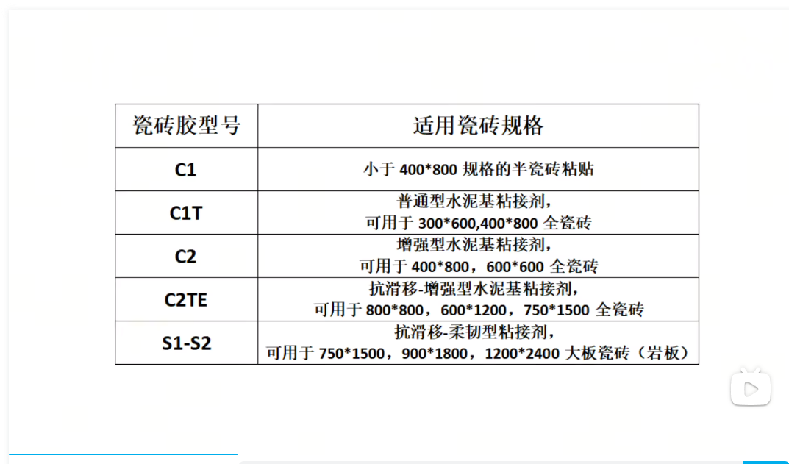

# 厨房
## 烟灶套装
侧吸 不过脸
美的j25s 1000+ 450的最大静压 风量越大越能吸越适合爆炒 风压越发越能排，油烟不会倒灌 抄底价1899
华帝百得E703C 24的风量 900的静压 套装比单独的烟机贵200 配的是5.2kw的灶 单烟机不划算 抄底价2699
老板23A7H   套装抄底加3000
## 净水器
## 热水器
1599 小米s1 jsq30-mj02 下置风机 半程零冷水 520 360 170  9米扬程、增压洗浴
1899 美的jsq30-mate 下置风机、水量伺服器 8年质保
2299 美的jsq30-mate ultra 下置风机、半程零冷水、增压水伺服、10米扬程、增压洗浴 8年质保
### 预算2000+ 用不上零冷水
2299 海尔KL3 jsq31-16KL3Pro-FPXCU1 下置风机 无级变频水伺服 一体全密闭无绕管结构 特色：5段微火控温、mpc+adrc、密闭稳燃仓
2699 海尔KT5 下置风机 半程零冷水 极速水伺服 10米扬程、增压洗浴 一体全密闭无绕管结构 5段微火控温 

## 冰箱
4799 海尔bcd466 830 636 1775 嵌入：零嵌，开门预留5cm 一级能效单蒸发 冷藏冷冻EPP超净 全空间保鲜

# 客厅
门窗洞的边缘处、柜子的周边、踢脚线的地方要做垂直；是否能和墙面的缝隙均匀
乳胶漆第一遍滚涂，最后一遍面漆不要兑水；瓷砖胶、玻璃胶、美缝剂不要用工人自带的；
## 空调

## 电视

## 灯具

# 一定要自己买的东西
地漏角阀自己网购，建议潜水艇六防九牧
瓷砖胶：全瓷砖上墙，瓷砖胶必不可少

品牌建议：马贝、西卡、德高、雨虹
腻子粉 品牌建议：美巢、圣戈班、立邦
乳胶漆：推荐网购，线下容易买到二手桶，网购大品牌的基础款
玻璃胶：网购大品牌比如马贝、瓦克、百德、西卡
隔音棉要自己买，网购     
止逆阀：贴砖前根据自己家的尺寸买好点的，潜水艇和方太
法兰圈：商家自带的黑色的便宜货就不要用了，网购才几块
# 卫生间
五金件安装的位置要打上一圈玻璃胶，即使后期漏水也能及时发现
## 防水
墙刚地柔
## 风暖浴霸
## 马桶
# 阳台
## 洗烘套装
## 封阳台
113型号，6腔体 玻璃5+27+5 开扇4道密封条 660一平
110型号，玻璃5+20+5 460一平方
玻璃厚度：+5mm
我的断桥铝配置，670一平米
坚美108断桥（原生铝）配置：
【品牌】：坚美（原生铝，真断桥）。
【型材】：国标1.4（最小厚度1.4，外框厚度1.8，开扇厚度1.53，压线厚度1.48）。
【玻璃】：国标5+24A+5（一体钢化）。
【隔热条】：国标PA66（24mm宽，C字型）。
【五金】：好博（品牌五金）。
【纱窗】：国标70防盗金钢网纱窗（304不锈钢70丝）。

单片玻璃面积不超过4个平米，型材宽度只要75到90的就够用了；.断桥铝壁厚1.8为宜；
中空隔热条要选一体折弯工艺的，不选对角工艺的，密封性更好，不漏水；
隔热条要选PA66尼龙条，不要用PVC的；密封胶条要选三元乙丙橡胶条，抗老化否则过几年容易漏风。
五金件决定了窗户的使用寿命。预算低选国产派阁、坚朗，.金刚网要高透的，普通的金刚网纱窗夏天不透风。
铝材表面要选氟碳喷涂工艺，每增加一个开扇要加多少钱，纱窗、护栏、拐角处、高空吊装等加不加钱，加多少；
安装窗户一定要安装在滴水线以内，至少要预留3公分；框架链接选整体连接、销钉注胶工艺的

总价=合同+材料+搬运+售后+折旧费用